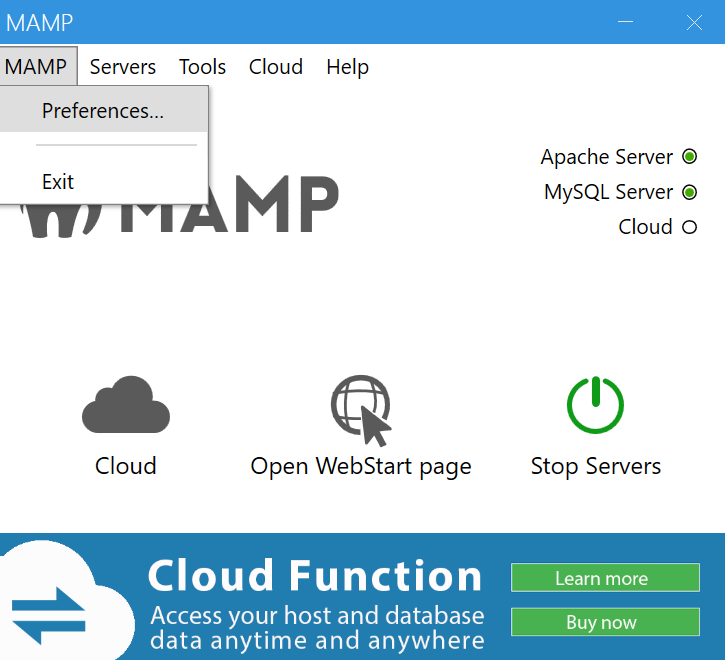
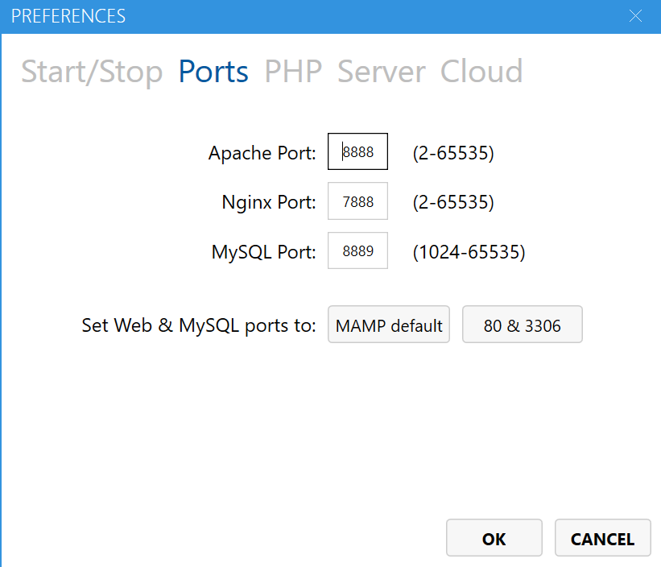
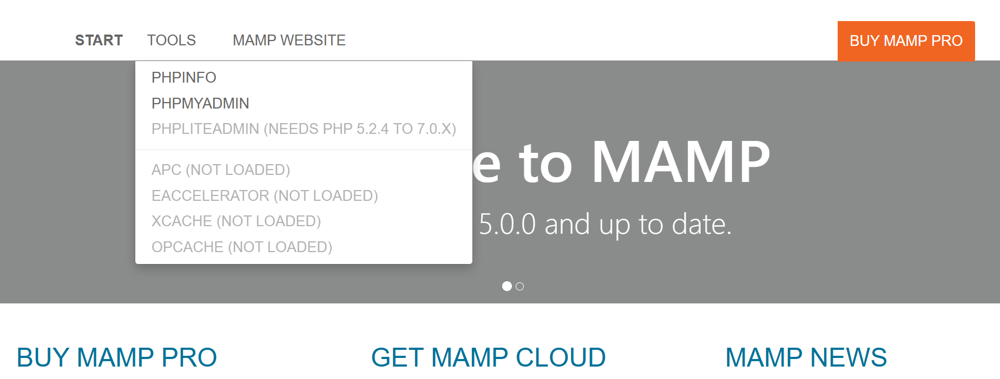
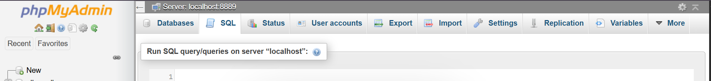
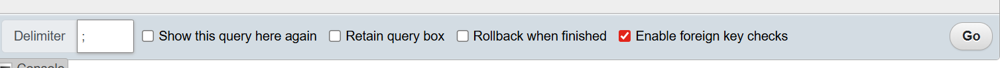

# AllergyPal

AllergyPal is an application used to quickly identify the allergens of concern for the user on products. The user can either utilize a device's camera to scan a bar code or directly search via keyword to retrieve the nutrition facts and ingredients of a given product. Users have the ability to customize their allergens of concern on their profile.

## Features
### Implemented:
- Users have numerous ways to access a product they want in a quick manner to look at the details/ingredients. They can either:
  - Search up a product from our database 
  - Scan a bar code or label of a product
- Users can register and sign into their accounts to save their allergens of concern.
### Planned: 
- Users will be able to access the history of their scanned/searched products.
- Allergens of concern will be saved to our server and linked to their profile.
- Allergens of concern is what will be prioritized in being displayed when a user evaluates a product.
- Users can view a product's details.

## Installation / Setup
###  1. Install MAMP
Navigate to in your browser:
```bash
https://www.mamp.info/en/downloads/
```
Scroll down to download for your respective `OS` (mac/Windows) and `architecture` (ARM/Intel CPU). The most recent version of MAMP will be on the top.

#### Check your architecture (for `macOS` only)
Open Terminal and run:
```
uname -m
```
| Output Example | Meaning                      |
| -------------- | ---------------------------- |
| `x86_64`       | Intel (64-bit)               |
| `i386`         | Older Intel (32-bit)         |
| `arm64`        | Apple Silicon ARM (M1/M2/M3) |

### 2. Run the MAMP Setup Wizard and install
### 3. Open File Explorer and locate your `htdocs` folder
Navigate to your MAMP installation directory and open the `htdocs` folder.

Default location (Windows):
`C:\MAMP\htdocs`

Default location (macOS):
`/Applications/MAMP/htdocs` (Need verification)

If you installed MAMP somewhere else, simply open your custom MAMP installation folder and locate the htdocs directory inside it.
### 4. Delete the index file inside `htdocs`
[TODO: Picture here]

### 5. Open `htdocs` in your IDE and clone the repo
```
git clone https://github.com/nluu05/AllergyPal.git
cd AllergyPal
```
### 6. Open the file `AllergyPal/Data/alldb.sql` and copy its contents to your clipboard

### 7. Run and open MAMP as `administrator`

### 8. Configure Ports under MAMP -> Preferences -> Ports




### 9. Take note of your Apache Port
You will need this in step 16.

### 10. Select `MAMP default` and click `OK`

### 11. Click `Start Servers`
Wait for it to finish starting. This will be indicated via the `Apache Server` and `MySQL Server` indicator nodes in the top right.
### 12. `Open WebStart Page`

### 13. Navigate to Tools -> PHPMYADMIN


### 14. Navigate to SQL


### 15. Paste in contents from step 6 and click `Go`


### 16. Navigate to Apache Port localhost in your browser
```
http://localhost:[APACHE_PORT]
```
Refer to step 9 if needed.

[TODO: Picture here]
### 17. Click into `AllergyPal`

### 18. Click into `guestmain.html`

## Tech stack
| Category | Technologies       |
| -------- | ------------------ |
| Frontend | HTML, CSS, JavaScript |
| Backend  |   PHP |
| Database |  MySQL              |

## Folder Structure
```
AllergyPal/
├── css/
│   ├── login.css
│   ├── nav.css
│   ├── profile.css
│   ├── register.css
│   ├── shared.css
│   └── usermain.css
├── Data/
│   ├── alldb.sql
│   └── dbConnect.php
├── images/
├── includes/
│   ├── footer.html
│   ├── navbar-guest.html
│   └── navbar-user.html
├── js/
│   ├── main.js
│   ├── register.js
│   └── scanner.js
├── php/
│   ├── checksession.php
│   ├── loginprocess.php
│   └── registerprocess.php
├── cookies.html
├── guestmain.html
├── login.html
├── login.php
├── profile.html
├── profile.php
├── register.php
├── scanner.html
├── usermain.html
└── README.md
```

## Developed and Tested by
- **Julia C** — [GitHub Profile](https://github.com/JCode-Art)
- **Trung H.** — [GitHub Profile](https://github.com/TrungH012006)
- **David K.** — [GitHub Profile](https://github.com/DKwokAsc)
- **Nhi L.** — [GitHub Profile](https://github.com/nluu05)
- **Shelby S.** — TODO
